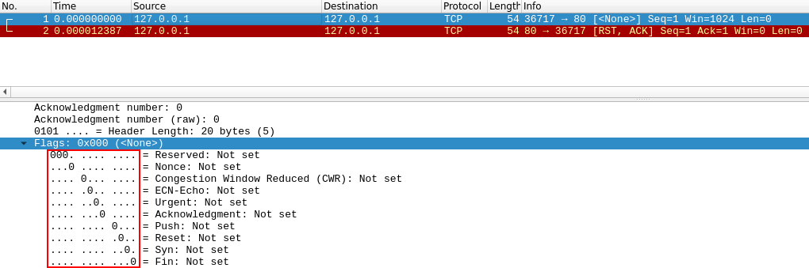

# Nmap Walkthrough


# By  V1J4Y4_5UR1Y4N V

         **THM NMAP Room Link → ([https://tryhackme.com/room/furthernmap](https://tryhackme.com/room/furthernmap))**

---

---

<aside>
🖥️ Port scanning is a critical first step in cybersecurity assessments. It helps identify open ports on a target system, revealing which services are running. Ports are essential for communication between computers, and knowing which ports are open is crucial for planning security measures.

</aside>

<aside>
🛰️ Nmap is a powerful network scanning tool used for discovering open ports, services, and vulnerabilities on target systems. It's a fundamental tool for network security assessments and reconnaissance.

</aside>

---

## Task 1 → Deploy

<aside>
                 Deploying the Machine and either connect with OpenVPN or use AttackBox .

</aside>

---

---

## Task 2 → Introduction

### **Questions**

> What networking constructs are used to direct traffic to the right application on a server?
> 
> 
> ```jsx
> Ports
> ```
> 
> How many of these are available on any network-enabled computer?
> 
> ```Plain Text
> 65535
> ```
> 
> **[Research]** How many of these are considered "well-known"? (These are the "standard" numbers mentioned in the task)
> 
> ```jsx
> 1024
> ```
> 

---

---

## Task 3 → Nmap Switches

### Questions

> What is the first switch listed in the help menu for a 'Syn Scan' (more on this later!)?
> 
> 
> ```jsx
> -sS
> ```
> 
> Which switch would you use for a "UDP scan"?
> 
> ```jsx
> -sU
> ```
> 
> If you wanted to detect which operating system the target is running on, which switch would you use?
> 
> ```jsx
> -O
> ```
> 
> 4.Nmap provides a switch to detect the version of the services running on the target. What is this switch?
> 
> ```jsx
> -sV
> ```
> 
> The default output provided by nmap often does not provide enough information for a pentester. How would you increase the verbosity?
> 
> ```jsx
> -v
> ```
> 
> > Verbosity level one is good, but verbosity level two is better! How would you set the verbosity level to two?
> > 
> > 
> > (**Note**: it's highly advisable to always use *at least* this option)
> > 
> > ```jsx
> > -vv
> > ```
> > 
> 
> We should always save the output of our scans -- this means that we only need to run the scan once (reducing network traffic and thus chance of detection), and gives us a reference to use when writing reports for clients.
> 
> What switch would you use to save the nmap results in three major formats?
> 
> ```jsx
> -oA
> ```
> 
> What switch would you use to save the nmap results in a "normal" format?
> 
> ```jsx
> -oN
> ```
> 
> A very useful output format: how would you save results in a "grepable" format?
> 
> ```
> -oG
> ```
> 
> Sometimes the results we're getting just aren't enough. If we don't care about how loud we are, we can enable "aggressive" mode. This is a shorthand switch that activates service detection, operating system detection, a traceroute and common script scanning.
> 
> How would you activate this setting?
> 
> ```
> -A
> ```
> 
> `Nmap` offers five levels of "timing" template. These are essentially used to increase the speed your scan runs at. Be careful though: higher speeds are noisier, and can incur errors!
> 
> How would you set the timing template to level 5?
> 
> ```
> -T5
> ```
> 
> We can also choose which port(s) to scan.
> 
> How would you tell nmap to only scan port 80?
> 
> ```jsx
> -p 80
> ```
> 
> How would you tell nmap to scan ports 1000-1500?
> 
> ```jsx
> -p 1000-1500
> ```
> 
> A very useful option that should not be ignored:
> 
> How would you tell nmap to scan *all* ports?
> 
> ```jsx
> -p-
> ```
> 
> How would you activate a script from the nmap scripting library (lots more on this later!)?
> 
> ```jsx
> --script
> ```
> 
> How would you activate all of the scripts in the "vuln" category?
> 
> ```jsx
> --script=vuln
> ```
> 

---

---

## Task 4 → Scan Types  Overview

When port scanning with Nmap, there are three basic scan types. These are:

- TCP Connect Scans (`sT`)
- SYN "Half-open" Scans (`sS`)
- UDP Scans (`sU`)

Additionally there are several less common port scan types, some of which we will also cover (albeit in less detail). These are:

- TCP Null Scans (`sN`)
- TCP FIN Scans (`sF`)
- TCP Xmas Scans (`sX`)

Most of these scans (excluding UDP scans) serve similar purposes but differ in their operation. While one of the first three scans is usually preferable, remember that other types of scans are available.

In terms of network scanning, we will also look briefly at ICMP (or "ping") scanning.

---

---

## Task 5 → Scan Types  TCP Connect Scans

To understand TCP Connect scans `(-sT)`, you need to be familiar with the *TCP three-way handshake.*

> The three-way handshake has three stages:
> 
> 1. Attacking machine sends TCP request with SYN flag to target server.
> 2. Server responds with TCP packet containing SYN and ACK flags.
> 3. Our machine completes handshake by sending TCP request with ACK flag set.
>     
>     
>     
> 
> TCP/IP networking has a basic principle and it relates to Nmap. A TCP Connect scan connects to every target port one by one and checks whether the service is open by the response it receives.
> 
> ---
> 
> There is a third possibility.
> 
> > What if the port is open, but hidden behind a firewall?
> > 
> 
> Many firewalls are configured to simply **drop** incoming packets. Nmap sends a TCP SYN request, and receives nothing back. This indicates that the port is being protected by a firewall and thus the port is considered to be *filtered*.
> 
> That said, it is very easy to configure a firewall to respond with a *RST TCP* packet. 
> 
> For example, in IP tables for Linux, a simple version of the command would be as follows:
> 
> `iptables -I INPUT -p tcp --dport <port> -j REJECT --reject-with tcp-reset`
> 
> This can make it extremely difficult (if not impossible) to get an accurate reading of the target(s).
> 

### Questions:

> Which RFC defines the appropriate behaviour for the TCP protocol?
> 
> 
> ```Plain Text
> RFC 9293
> ```
> 
> Hint
> 
> If a port is closed, which flag should the server send back to indicate this?
> 
> ```Plain Text
> RST
> ```
> 

---

---

## Task 6 → Scan Types SYN Scans

As with TCP scans, SYN scans (`-sS`) are used to scan the TCP port-range of a target or targets; however, the two scan types work slightly differently. SYN scans are sometimes referred to as "*Half-open"* scans, or *"Stealth"* scans.

Where TCP scans perform a full three-way handshake with the target, SYN scans sends back a RST TCP packet after receiving a SYN/ACK from the server (this prevents the server from repeatedly trying to make the request).

---

**Disadvantages to SYN scans**, namely:

- They require *`sudo`* permissions in order to work correctly in Linux. This is because SYN scans require the ability to create raw packets (as opposed to the full TCP handshake), which is a privilege only the root user has by default.
    
    [1]
    
- Unstable services are sometimes brought down by SYN scans, which could prove problematic if a client has provided a production environment for the test.

All in all, the pros outweigh the cons.

For this reason, SYN scans are the default scans used by Nmap *if run with sudo permissions*. If run **without** *`sudo`* permissions, Nmap defaults to the TCP Connect scan we saw in the previous task.

### Questions

> There are two other names for a SYN scan, what are they?
> 
> 
> ```Plain Text
> Half-Open, Stealth
> ```
> 
> Can Nmap use a SYN scan without Sudo permissions (Y/N)?
> 
> ```Plain Text
> N
> ```
> 

---

---

## Task 7 → Scan Types UDP Scans

Unlike *TCP*, *UDP* connections are *stateless*.

Scanning with  `nmap -sU --top-ports 20 <target>`. Will scan the top 20 most commonly used UDP ports, resulting in a much more acceptable scan time.

### Questions

> If a UDP port doesn't respond to an Nmap scan, what will it be marked as?
> 
> 
> ```Plain Text
> open|filtered
> ```
> 
> When a UDP port is closed, by convention the target should send back a "port unreachable" message. Which protocol would it use to do so?
> 
> ```Plain Text
> ICMP
> ```
> 

---

---

## Task 8 → Scan Types NULL, FIN and Xmas

NULL, FIN and Xmas TCP port scans are less commonly used than any of the others we've covered already.

- As the name suggests, NULL scans (`-sN`) are when the TCP request is sent with no flags set at all. As per the RFC, the target host should respond with a RST if the port is closed.
    
    
    
- FIN scans (`-sF`) work in an almost identical fashion; however, instead of sending a completely empty packet, a request is sent with the FIN flag (usually used to gracefully close an active connection). Once again, Nmap expects a RST if the port is closed.
    
    
    
- As with the other two scans in this class, Xmas scans (`-sX`) send a malformed TCP packet and expects a RST response for closed ports. It's referred to as an xmas scan as the flags that it sets (PSH, URG and FIN) give it the appearance of a blinking christmas tree when viewed as a packet capture in Wireshark.
    
    
    

### Questions

> Which of the three shown scan types uses the URG flag?
> 
> 
> ```Plain Text
> Xmas
> ```
> 
> Why are NULL, FIN and Xmas scans generally used?
> 
> ```Plain Text
> firewall evasion
> ```
> 
> Which common OS may respond to a NULL, FIN or Xmas scan with a RST for every port?
> 
> ```Plain Text
> Microsoft Windows
> ```
> 

---

---

## Task 9 → Scan Types ICMP Network Scanning

On first connection to a target network in a black box assignment, our first objective is to obtain a "map" of the network structure -- or, in other words, we want to see which IP addresses contain active hosts, and which do not.

- By using NMAP “*ping sweep*” we can achieve this, To perform the *ping sweep* we **use `-sn` in conjuction with IP ranges specified with either a hypen `-` or CIDR notation `/`

### Questions

> How would you perform a ping sweep on the 172.16.x.x network (Netmask: 255.255.0.0) using Nmap? (CIDR notation)
> 
> 
> ```Plain Text
> nmap -sn 172.16.0.0/16
> ```
> 
> <aside>
> 💡 **The CIDR notation uses a slash/then the number of bits that need to be turned on in the mask. So for a Class A it would be /8, for Class B it would be /16, and finally for a Class C it would be /24.**
> 
> </aside>
> 

---

---

## Task 10 → NSE Scripts Overview

The **N**map **S**cripting **E**ngine (**NSE**) is an incredibly powerful addition to Nmap, extending its functionality quite considerably. NSE Scripts are written in the *Lua* programming language, and can be used to do a variety of things: from scanning for vulnerabilities, to automating exploits for them. The NSE is particularly useful for reconnaisance.

**Some useful Categories:**

- `safe`:- Won't affect the target
- `intrusive`:- Not safe: likely to affect the target
- `vuln`:- Scan for vulnerabilities
- `exploit`:- Attempt to exploit a vulnerability
- `auth`:- Attempt to bypass authentication for running services (e.g. Log into an FTP server anonymously)
- `brute`:- Attempt to bruteforce credentials for running services
- `discovery`:- Attempt to query running services for further information about the network (e.g. query an SNMP server).

### Questions

> What language are NSE scripts written in?
> 
> 
> ```Plain Text
> lua
> ```
> 
> Which category of scripts would be a *very* bad idea to run in a production environment?
> 
> ```Plain Text
> intrusive
> ```
> 

---

---

## Task 11 → NSE Scripts Working with the NSE

We looked briefly about `--script` switch the `vuln` category using `--script=vuln` . If the command `--script=safe` is run, then any applicable safe scripts will be run against the target

To run a specific script, we would use `--script=<script-name>` , 

e.g. `--script=http-fileupload-exploiter`.

Multiple scripts can be run simultaneously in this fashion by separating them by a comma. 

For example: `--script=smb-enum-users,smb-enum-shares`.

Some scripts require arguments. These can be given with the `--script-args` Nmap switch. An example of this would be with the `http-put` script (used to upload files using the PUT method). This takes two arguments: the URL to upload the file to, and the file's location on disk.  

For example:`nmap -p 80 --script http-put --script-args http-put.url='/dav/shell.php',http-put.file='./shell.php'`

### Questions

> What optional argument can the `ftp-anon.nse` script take?
> 
> 
> ```Plain Text
> maxlist
> ```
> 

---

---

### Task 12 → NSE Scripts Searching for Scripts

We can search the script by two methods

- **Nmap Website ([https://nmap.org/nsedoc/](https://nmap.org/nsedoc/))**
- **Local storage**  —> Nmap stores its scripts on Linux at `/usr/share/nmap/scripts`. All of the NSE scripts are stored in this directory by default -- this is where Nmap)

Let us see an example of local storage script by using the `/usr/share/nmap/scripts/script.db` file. Despite the extension, this isn't actually a database so much as a formatted text file containing filenames and categories for each available script.


Nmap uses this file to keep track of (and utilise) scripts for the scripting engine; however, we can also *grep* through it to look for scripts. 

For example: `grep "ftp" /usr/share/nmap/scripts/script.db`.


The second way to search for scripts is quite simply to use the `ls` command. For example, we could get the same results as in the previous screenshot by using 

`ls -l /usr/share/nmap/scripts/*ftp*`:


*Note the use of asterisks* (`*`) *on either side of the search term*

The same techniques can also be used to search for categories of script. For example:

`grep "safe" /usr/share/nmap/scripts/script.db`

I*nstalling New Scripts*

We mentioned previously that the Nmap website contains a list of scripts, so, what happens if one of these is missing in the `scripts` directory locally? A standard `sudo apt update && sudo apt install nmap` should fix this; however, it's also possible to install the scripts manually by downloading the script from Nmap (`sudo wget -O /usr/share/nmap/scripts/<script-name>.nse https://svn.nmap.org/nmap/scripts/<script-name>.nse`). This must then be followed up with `nmap --script-updatedb`, which updates the `script.db` file to contain the newly downloaded script.

### Questions

> Search for "smb" scripts in the `/usr/share/nmap/scripts/` directory using either of the demonstrated methods.What is the filename of the script which determines the underlying OS of the SMB server?
> 
> 
> ```Plain Text
> **smb-os-discovery.nse**
> ```
> 
> Read through this script. What does it depend on?
> 
> ```Plain Text
> **smb-brute**
> ```
> 

---

---

### Task 13 → Firewall Evasion

The following switches are of particular note:

- `f`:- Used to fragment the packets (i.e. split them into smaller pieces) making it less likely that the packets will be detected by a firewall or IDS.
- An alternative to `f`, but providing more control over the size of the packets: `-mtu <number>`, accepts a maximum transmission unit size to use for the packets sent. This *must* be a multiple of 8.
- `-scan-delay <time>ms`:- used to add a delay between packets sent. This is very useful if the network is unstable, but also for evading any time-based firewall/IDS triggers which may be in place.
- `-badsum`:- this is used to generate in invalid checksum for packets. Any real TCP/IP stack would drop this packet, however, firewalls may potentially respond automatically, without bothering to check the checksum of the packet. As such, this switch can be used to determine the presence of a firewall/IDS.

### Questions

Which simple (and frequently relied upon) protocol is often blocked, requiring the use of the `-Pn` switch?

```Plain Text
ICMP
```

**[Research]** Which Nmap switch allows you to append an arbitrary length of random data to the end of packets?

```Plain Text
--data-lenght
```

---

---

## Task 14 → Practical

### Questions

> Does the target (`10.10.44.130`)respond to ICMP (ping) requests (Y/N)?
> 
> 
> 
> 
> ```Plain Text
> N
> ```
> 
> Perform an Xmas scan on the first 999 ports of the target -- how many ports are shown to be open or filtered?
> 
> 
> 
> ```Plain Text
> 999
> ```
> 
> There is a reason given for this -- what is it?
> 
> **Note:** The answer will be in your scan results. Think carefully about which switches to use -- and read the hint before asking for help!
> 
> ```Plain Text
> No response
> ```
> 
> Hint
> 
> Perform a TCP SYN scan on the first 5000 ports of the target -- how many ports are shown to be open?
> 
> 
> 
> ```Plain Text
> 5
> ```
> 
> Deploy the `ftp-anon` script against the box. Can Nmap login successfully to the FTP server on port 21? (Y/N)
> 
> 
> 
> ```Plain Text
> Y
> ```
> 

---

---

## Task 15 → Conclusion

We have successfully completed the NMAP room

<aside>
💡 For further details about NMAP  you can refer this docs ([https://nmap.org/book/](https://nmap.org/book/))

</aside>
